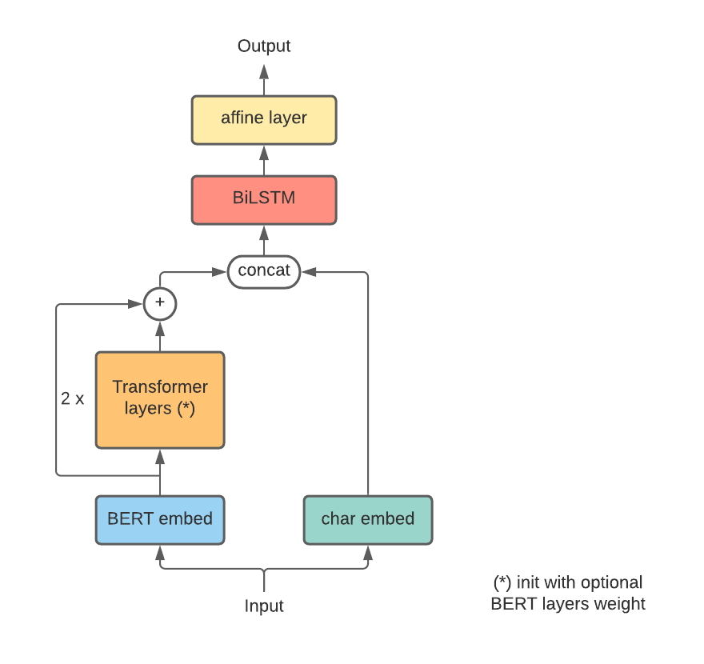

# CharEmbedding + BERT + BiLSTM + Biaffine for Vietnamese person name recognition

## Installation
`pip install requirement.txt`

### Model
There are 3 main options for using BERT which is `args.model_name_or_path` in this pipeline 
- `use_bert=True`: use embedding + transformer layers of BERT  
- `bert_embed_only=True` : only using embedding in BERT
- `use_bert=False`, `bert_embed_only=False`, `num_layer_bert=2` : use embedding + 2 layers in BERT

### Training model 

1. Train normal
```
python main.py --aug_offline False --aug_online False --ckpt_dir ckpt --log_file log_normal.csv
```
2. Train augmentation
```
python main.py --aug_offline True \
--aug_lastname 0.2 --aug_lowercase 0.2 --aug_remove 0.15 \
--ckpt_dir ckpt_aug_offline --log_file log_aug_off.csv
```
3. Train augmentation online
```
python main.py --aug_online True --use_aug_every 3 \
--aug_lastname 0.2 --aug_lowercase 0.2 --aug_remove 0.15 \ 
--ckpt_dir ckpt_aug_online --log_file log_aug_onl.csv
```

4. Finetune trained model
```
python main.py --batch_size 256 --ckpt_dir finetune --learning_rate 2e-4 --log_file log_ft.csv \
--use_pretrained True --load_ckpt 'finetune/checkpoint_0.925.pth'
```

### Evaluate 
1. Evaluate checkpoint
```
python evaluate.py --load_ckpt ckpt/checkpoint_0.959.pth --batch_size 256
```

2. Evaluate baseline model (151M params)
```
python evaluate.py --load_ckpt ckpt_baseline/checkpoint.pth --use_bert True --num_layer_bert 4 --eval_num_layer_bert 4 --human_test_data './data/person_name/human_test.json'
```
### TODO  
- Save model per batch
- Update human testset
- 